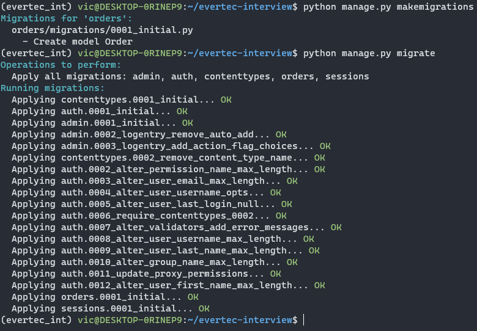
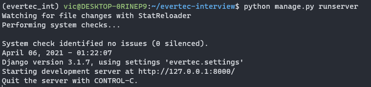
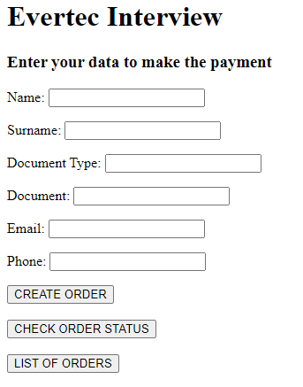
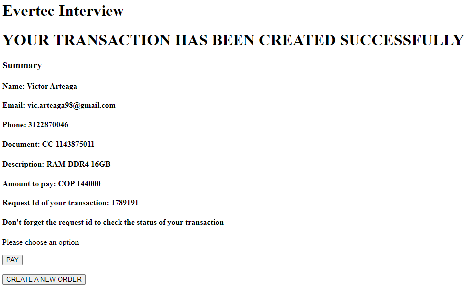
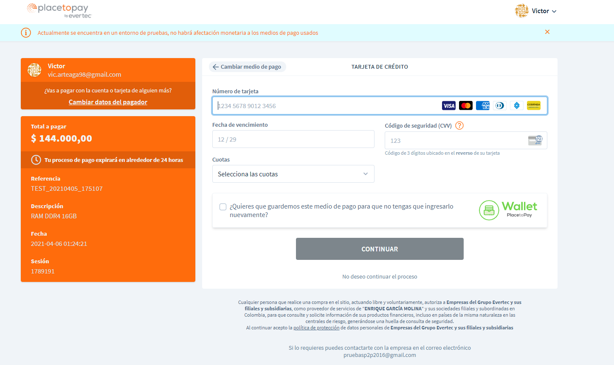
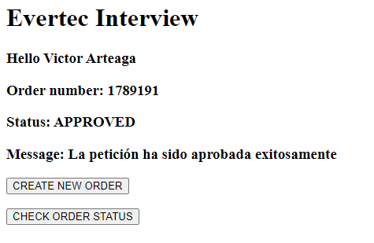
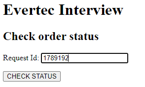
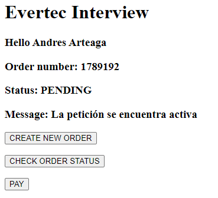

# EVERTEC INTERVIEW

## REQUERIMIENTOS

- Cree una tienda con la migración de la base de datos presentada en el escenario y las modificaciones adicionales necesarias para poder realizar el flujo especificado
La tienda debe contener las siguientes vistas
    - Una donde el cliente proporcione los datos necesarios para generar una nueva orden
    - Una donde se presente un resumen de la orden y se permita proceder a pagar
    - Una donde el cliente pueda ver el estado de su orden, si está pagada muestre el mensaje de que está pagada, de lo contrario, un botón que permita reintentarlo debe estar presente
    - Una donde se pueda ver el listado de todas las órdenes que tiene la tienda

## USO

- Clonar el repositorio usando HTTPS
- Este proyecto fue desarrollado usando el framework Django por lo tanto cree un ambiente de desarrollo para este proyecto especificamente usando 'anaconda'.
    - Primero se debe instalar anaconda en el siguiente [link](https://docs.anaconda.com/anaconda/install/) pueden seguir las instrucciones para el sistema operativo que esten usando.
    - En el root de este repositorio se encuentra el archivo '.yml' que contiene el ambiente.
    - Para crear el ambiente debemos ir al root del proyecto y escribir lo siguiente:
        - conda env create -f environment.yml
        - Luego 'conda env list' para verificar que se haya creado        
- Una vez con el ambiente creado procederemos a correr los siguientes comandos en el root del proyecto para correr el servidor:
    - python manage.py makemigrations
    - python manage.py migrate
    - En este punto ya se habrán creado las tablas necesarias en la base de datos.
    
    - Por ultimo 'python manage.py runserver'.
    
- Con el servidor corriendo nos dirigimos a la URL '127.0.0.1:8000' en la cual podremos diligenciar el formulario para crear una orden y al mismo tiempo tener la opcion para revisar las ordenes que ya estan creadas y en caso de contar con el 'requestId' de una orden podremos dirigirnos a verificar su estado.

- Cuando llenamos el formulario y presionamos el boton 'CREATE ORDER', nos llevara a una vista en la cual podremos ver los detalles de la orden que acabamos de crear.

- Una vez allí podemos seleccionar si queremos dirigirnos al pago de la orden o si deseamos volver para crear una nueva.
- Al presionar 'PAY' nos redirigirá a la pagina sucursal de 'placetopay' para realizar el pago correspondiente.

- Una vez realizado el pago volveremos nuevamente a nuestra pagina pero nos llevara a una vista donde veremos el estado actual de la orden que acabamos de pagar

- Aquí podemos ir a revisar el estado de alguna orden presionando el boton 'CHECK ORDER STATUS' o directamente volver al paso 1 para crear una nueva orden.
- Si seleccionamos en algun momento 'CHECK ORDER STATUS' nos pedira el 'requestId'.

- Una vez ingresemos el 'requestId' y verifiquemos el estado nos saldrá algo como esto.

- En caso de que el estado sea 'PENDING' nos aparecerá el botón 'PAY' el cual nos llevará nuevamente a la sucursal de pago para poder seguir realizando el pago.
- Si en algun momento queremos ver la cantidad de ordenes que han sido creadas basta con seleccionar el boton 'LIST OF ORDERS' y nos llevará a una vista en la que se desplegará las ordenes que se han realizado con su respectiva información.

## AUTHORS
- Victor Arteaga [LinkedIn](https://www.linkedin.com/in/viiic98/)